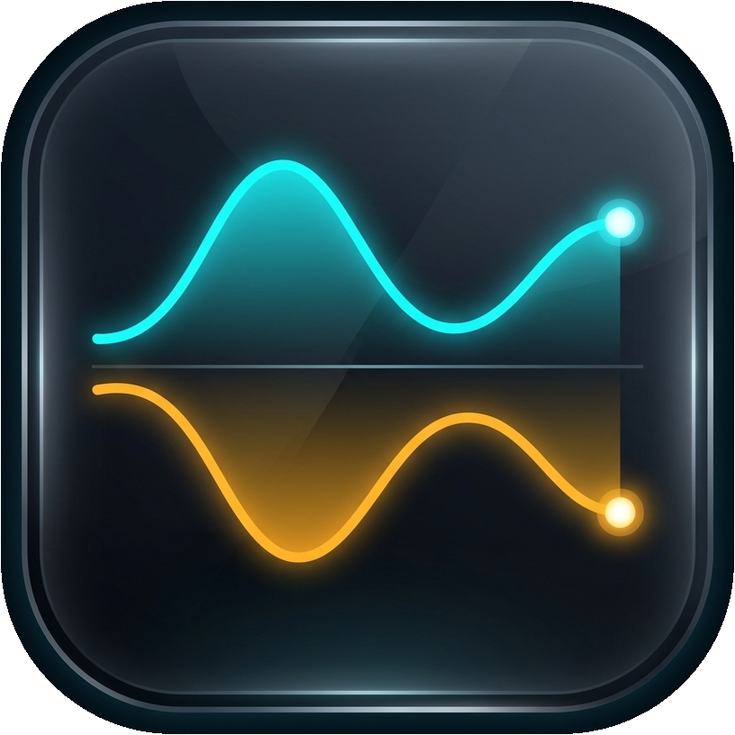

<div align="center">



# 📊 Net Flow

**Real-Time Network Bandwidth Telemetry & Native Windows 11 Widget**

*Built in pure Rust for maximum performance, buttery-smooth fluid waveforms, and near-zero resource footprint.*

[](https://github.com/rockerrishabh/net-flow/actions/workflows/ci.yml)
[](CHANGELOG.md)
[](https://apps.microsoft.com/detail/9PCR54NGJ94J?mode=direct&cid=github_shield)
[](https://www.microsoft.com/windows)
[](https://www.rust-lang.org/)
[](#-license)

<br/>
<br/>

<a href="https://apps.microsoft.com/detail/9PCR54NGJ94J?mode=direct&cid=github_hero">
  <picture>
    <source media="(prefers-color-scheme: dark)" srcset="https://get.microsoft.com/images/en-us%20dark.svg">
    <source media="(prefers-color-scheme: light)" srcset="https://get.microsoft.com/images/en-us%20light.svg">
    
  </picture>
</a>

</div>

---

## ✨ Highlights

- **🪟 Native Windows 11 Widgets Board Integration**: First-class widget integration (<kbd>Win</kbd> + <kbd>W</kbd>) with native Adaptive Cards v1.6 support across **Small**, **Medium**, and **Large** card dimensions.
- **📈 Mirrored Dual-Stream Waveforms**: An in-memory supersampled sparkline rendering download traffic above the baseline (in vibrant cyan `#38D9F0`) and upload traffic below (in warm amber `#FFB020`) on a shared scale with glowing pulse nodes.
- **🌊 50 KB/s Scale Floor & Headroom**: A vertical scale floor keeps sub-kilobyte background network noise proportional, while 18% vertical headroom cushions traffic spikes from card boundaries.
- **⚡ Ultra-Low Resource Usage**: Uses native Windows `IP Helper` (`GetIfTable2`) APIs and asynchronous Rust for near-zero CPU (< 0.1%) and negligible RAM footprint (< 15 MB).
- **🛜 Smart Active Adapter Detection**: Auto-detects the primary active network adapter with contextual badges (Wi-Fi with friendly SSID, Ethernet, Cellular, VPN).
- **📱 Per-App Bandwidth Attribution**: Tracks active applications consuming network bandwidth with compact rate formatting (`↓ 11.1 ↑ 9.1 KB/s (37)`) and generous 22-character name budgets.
- **📊 Session Usage Tracking**: Monitors cumulative upload/download data transferred and active session duration with an inline **Reset** button.
- **⚙️ In-Card Customization**: Configurable speed units (Auto-scaled, Bytes/s, KB/s, MB/s, Gbps) and adjustable waveform time windows (15s, 30s, 60s, 120s) directly inside the widget card.

---

## 📥 Installation

### 1. Microsoft Store (Recommended)
Net Flow is available directly through the Microsoft Store with seamless background updates:

<a href="https://apps.microsoft.com/detail/9PCR54NGJ94J?mode=direct&cid=github_install">
  <picture>
    <source media="(prefers-color-scheme: dark)" srcset="https://get.microsoft.com/images/en-us%20dark.svg">
    <source media="(prefers-color-scheme: light)" srcset="https://get.microsoft.com/images/en-us%20light.svg">
    
  </picture>
</a>

👉 *Or launch directly in the Windows Store app via protocol:* [`ms-windows-store://pdp/?productid=9PCR54NGJ94J`](ms-windows-store://pdp/?productid=9PCR54NGJ94J)

### 2. Local Developer Sideloading
If building from source or testing modifications locally:

```powershell
# Clone the repository
git clone https://github.com/rockerrishabh/net-flow.git
cd net-flow

# One-command build, packaging, self-signing, and sideload registration
powershell -ExecutionPolicy Bypass -File scripts/install.ps1
```

Once installed:
1. Press <kbd>Win</kbd> + <kbd>W</kbd> to open the **Windows Widgets Board**.
2. Click **+** (**Add Widgets**) in the top-right corner.
3. Select **Net Flow** and pin your preferred size (Small, Medium, or Large).

### 3. Sideload Release Bundle
1. Download `net-flow-windows-x64.zip` from [GitHub Releases](https://github.com/rockerrishabh/Net-Flow/releases).
2. Extract the archive.
3. Run `.\install.ps1` in PowerShell (or right-click `install.ps1` → **Run with PowerShell**).
The installer automatically provisions a local signing certificate, packages `NetFlow.msix`, and registers the widget package into Windows 11. To uninstall, run `.\install.ps1 -Uninstall`.

---

## ⚡ Performance & Architectural Hardening

Net Flow is engineered from the ground up for zero distraction, extreme reliability, and minimal system impact:

| Metric / Component | Implementation | Impact |
| :--- | :--- | :--- |
| **Release Binary Size** | Link-Time Optimization (`lto = true`, `strip = true`, `codegen-units = 1`) | **1.24 MB** standalone executable |
| **CPU Utilization** | Direct Win32 IP Helper polling (`GetIfTable2`) & diffing | **< 0.1% CPU** during active monitoring |
| **Memory Footprint** | Bounded caches & in-memory rasterization | **< 15 MB** working set |
| **Process Sampling** | Decoupled 1.0s process inspection + 500ms network throughput polling | Zero system scheduler jitter or scaling distortion |
| **COM Lifetime** | Automatic idle detection with 30s grace period and `CoRevokeClassObject` | **Zero zombie background processes** when unpinned |
| **Lock Poison-Safety** | Poison-recovering extension traits (`lock_safe`, `read_safe`, `write_safe`) | Fault-tolerant under `panic = "abort"` |
| **Log Management** | Thread-safe 1MB rotating logger in `%TEMP%` | Prevents disk bloat; quiet by default |

---

## 🔒 Privacy & Permissions (Why "Precise Location"?)

When running Net Flow, Windows 11 may show Net Flow under **Settings → Privacy & security → Location** or briefly show the taskbar location icon. 

### Why Does Windows Flag This?
1. **Friendly Wi-Fi Name**: In the card header, Net Flow displays the name of your active Wi-Fi network (e.g. `Home-5G` instead of generic `Wi-Fi`).
2. **The Win32 Wi-Fi API**: To read that SSID, Net Flow queries the Windows Native Wi-Fi API (`wlanapi.dll` via `WlanQueryInterface`).
3. **Microsoft's Privacy Grouping**: Because nearby Wi-Fi network names (SSIDs and BSSIDs) can theoretically be cross-referenced against global Wi-Fi positioning databases to estimate a device's physical location, Windows 10/11 classifies all native Wi-Fi scanning and query APIs under the **"Precise Location"** permission toggle.

### Our Privacy Guarantee
- **Zero Location Tracking**: Net Flow contains **zero GPS code, zero geolocation libraries, and makes zero network requests**.
- **100% Offline**: Net Flow does not transmit any data over the internet. There are **zero diagnostics, zero analytics, and zero telemetry servers**.
- **Completely Optional**: If you disable location in Windows Settings, Net Flow continues running with 100% functionality—it simply displays `Wi-Fi` in the header instead of your network name.

📖 For complete details, see our [Privacy Policy (PRIVACY.md)](PRIVACY.md).

---

## 🏗️ Architecture

Net Flow is structured as a modular, high-performance Rust workspace:

```text
net-flow/
├── .github/
│   └── workflows/
│       ├── ci.yml                     # Continuous integration & MSIX packaging validation
│       ├── release.yml                # GitHub Release pipeline (triggered on Git tags)
│       └── store-publish.yml          # Microsoft Store submission pipeline (manual dispatch)
├── crates/
│   └── core/                          # net-flow-core (pure Rust core logic)
│       ├── src/
│       │   ├── backend.rs             # IP Helper polling, delta computing & interface classification
│       │   ├── card.rs                # Adaptive Cards v1.6 JSON builders & templates
│       │   ├── chart.rs               # In-memory dual-stream waveform rasteriser
│       │   ├── format.rs              # Bandwidth scaling & humanized unit formatting
│       │   ├── icons.rs               # Embedded vector glyphs (PNG data URIs)
│       │   └── process.rs             # Active process network attribution & bounded icon cache
├── widget/                            # net-flow (Windows App SDK COM widget provider)
│   ├── Assets/                        # Master branding, high-DPI logos, app.ico, and favicon pack
│   │   ├── MasterLogo.png             # 816x816 high-res squircle master logo
│   │   ├── Square150x150Logo.png      # 300x300 Windows tile logo
│   │   ├── Square44x44Logo.png        # 88x88 widget header & provider logo
│   │   ├── StoreLogo.png              # 100x100 Microsoft Store logo
│   │   ├── app.ico                    # Multi-res Windows executable icon (256, 128, 64, 48, 32, 16)
│   │   └── favicon.ico                # Web & docs favicon suite (48, 32, 16)
│   ├── Package.appxmanifest           # Open-source generic manifest template
│   ├── build.rs                       # Resource compilation & icon embedding
│   └── src/
│       ├── bindings.rs                # Windows App SDK WinMD bindings
│       ├── factory.rs                 # Out-of-proc COM ClassFactory implementation
│       ├── main.rs                    # WinMain entry point, COM lifecycle & idle shutdown
│       └── provider.rs                # IWidgetProvider2 handler with poison-resilient locks
├── scripts/
│   └── install.ps1                    # Sideload packaging, certificate provisioning & registration
├── Cargo.toml                         # Workspace manifest & LTO release profile
├── CHANGELOG.md                       # Release notes & version history
├── CODE_OF_CONDUCT.md                 # Contributor Covenant v2.1
├── CONTRIBUTING.md                     # Contributor guide & developer workflow
├── LICENSE-APACHE                     # Apache 2.0 License
├── LICENSE-MIT                        # MIT License
├── PRIVACY.md                         # Store-ready Privacy Statement & location disclosure
└── SECURITY.md                        # Security policy & vulnerability reporting
```

---

## 🧪 Testing & Verification

Run all 75 workspace unit tests:
```powershell
cargo test --workspace
```

Run Clippy with strict zero-warnings enforcement:
```powershell
cargo clippy --workspace --all-targets --all-features -- -D warnings
```

Build the optimized release binary (1.24 MB):
```powershell
cargo build --release --workspace
```

---

## 📦 CI/CD & Microsoft Store Publishing

Net Flow includes automated GitHub Actions workflows:

1. **`ci.yml`**: Runs on every push and pull request. Validates formatting, executes all 75 unit tests, and verifies MSIX layout packaging.
2. **`release.yml`**: Triggered on Git tags (e.g. `v0.1.0`) or manual workflow dispatch. Builds the optimized binary, packages the MSIX, creates public sideload certificates, computes SHA256 checksums, extracts release notes from `CHANGELOG.md`, and publishes the **GitHub Release**.
3. **`store-publish.yml`**: Triggered manually via workflow dispatch. Builds the Store MSIX with Partner Center credentials and submits updates to the **Microsoft Store** via the Store Submission API.

---

## 👤 Author & Maintainer

Net Flow is an independent open-source project created and actively maintained by:

- **Rishabh Kumar**
- GitHub: [@rockerrishabh](https://github.com/rockerrishabh)
- Email: [admin@rockerrishabh.me](mailto:admin@rockerrishabh.me)

---

## 📜 Documentation

- [Changelog](CHANGELOG.md) — Version history and release notes.
- [Contributing Guide](CONTRIBUTING.md) — How to develop, test, and contribute.
- [Privacy Policy](PRIVACY.md) — Privacy commitments and location disclosure.
- [Security Policy](SECURITY.md) — Vulnerability reporting and threat model.
- [Code of Conduct](CODE_OF_CONDUCT.md) — Community standards.

---

## 📄 License

This project is dual-licensed under either of:

- **MIT License** ([LICENSE-MIT](LICENSE-MIT) or <http://opensource.org/licenses/MIT>)
- **Apache License, Version 2.0** ([LICENSE-APACHE](LICENSE-APACHE) or <http://www.apache.org/licenses/LICENSE-2.0>)

at your option.

### Contributions
Unless you explicitly state otherwise, any contribution intentionally submitted for inclusion in Net Flow by you shall be dual-licensed as above, without any additional terms or conditions.
